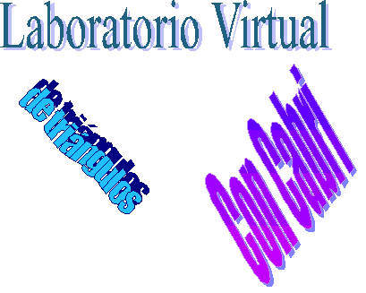

El Laboratorio Virtual de Triángulos con Cabri es una revista on-line de matemáticas dedicada a la resolución de problemas sobre triángulos.

Está dirigida por mi amigo Ricardo Barroso Campos, profesor de Didáctica de las Matemáticas de la Universidad de Sevilla.

Esta relación de amistad y el gran acierto de su trabajo hace que sea un placer para mí, en la medida de mis posibilidades, colaborar en la revista.

## 

| :------: | :---: | :-------: | :-----: |
| [Curso 2021/22](curso20212022/index.htm) | [Curso 2020/21](curso20202021/index.htm)|  [Curso 2019/20](curso20192020/index.htm)|  [Curso 2018/19](curso20182019/index.htm)|
| opción 2 |       |     x     |         |
| opcion 3 |   x   |           |    x    |

## NOTICIAS
